#### Azure Virtual WAN - Understanding Bypass Next Hop IP for workloads within this VNet.

Have you used Azure Virtual WAN and noticed this setting? Bypass Next Hop IP for workloads within this VNet? What exactly does this mean? In this short blog, I thought I would go through what this means, how to test this configuration and why you may think about setting it up. 

In our example, a virtual appliance is deployed within a spoke virtual network connected to our VWAN hub resource. (We are using Azure Firewall in the spoke virtual network, but this could be any network virtual appliance.). We have advertised a default 0.0.0.0/0 to other spoke virtual networks with a next hop to our Azure Firewall private IP address. I've provided a high-level diagram below.

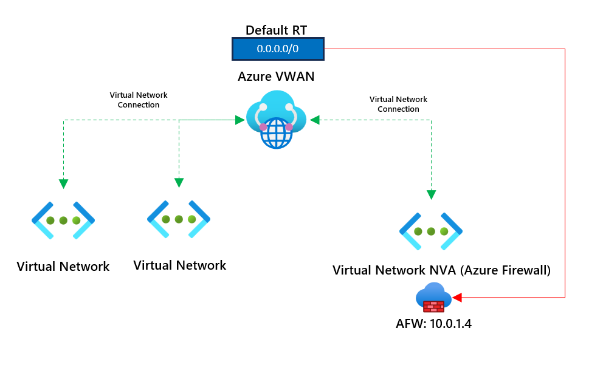

All virtual networks are connected directly to the VWAN hub. This ensures virtual machines can communicate in different virtual networks using Azure VWAN.

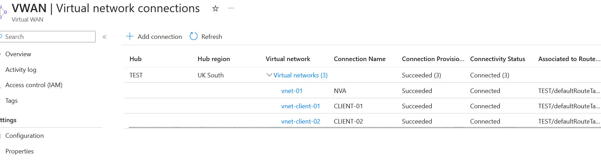

Virtual machines in virtual networks will go outbound via the Azure Firewall in the NVA virtual network; we've advertised a default route to next hop the Azure Firewall. 

To test connectivity between a virtual machine in one virtual network and another, I've deployed two Linux virtual machines to confirm connectivity. The connectivity test I am confirming can be found below. The line is highlighted in purple.

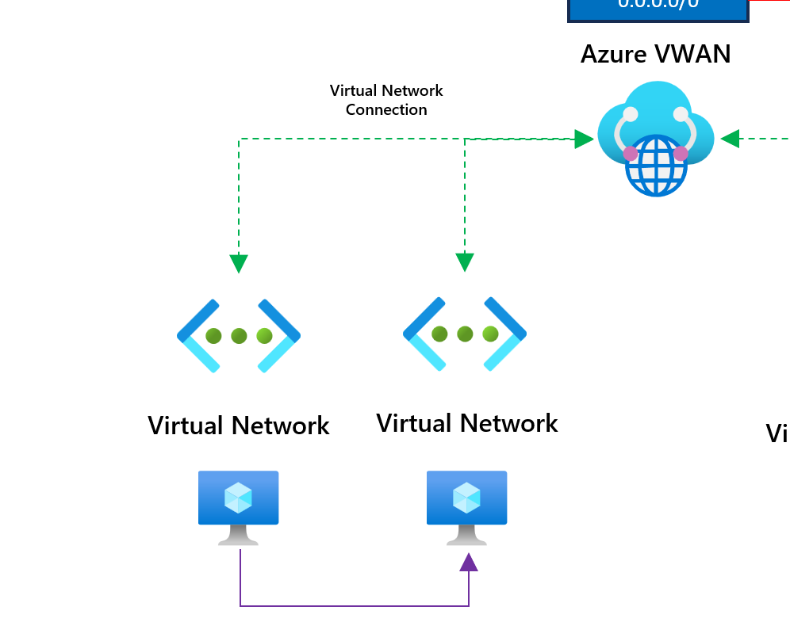

Sending a ping from 192.168.1.4 to 192.168.2.4 is working as expected, which confirms that connectivity is in place.

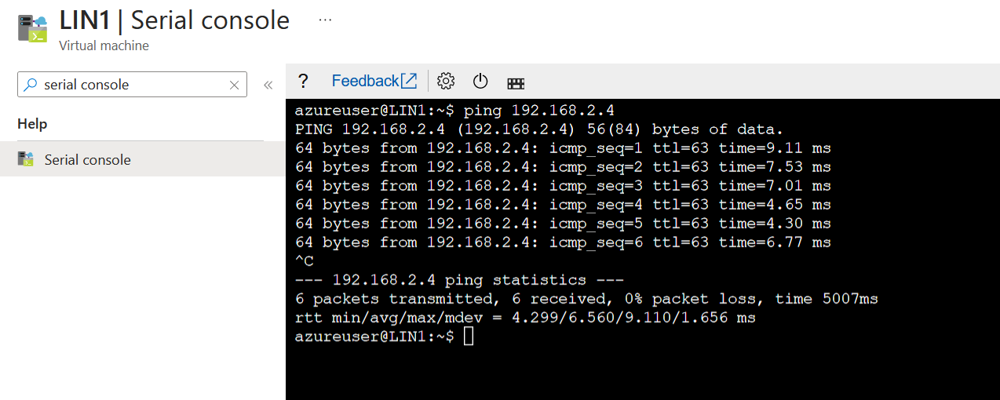

Let's test if connectivity is working going outbound to the internet. This should be routed through the Azure Firewall in the NVA virtual network. We have a default static 0.0.0.0/0 to route all traffic via the Firewall. 

We have two rules on the Firewall. One network rule allows us to use Azure DNS, and an application rule allows us to go to ifconfig.me, a site that returns the public IP address we use going outbound to the internet. 

Running curl ifconfig.me returns the public IP address of the Firewall.

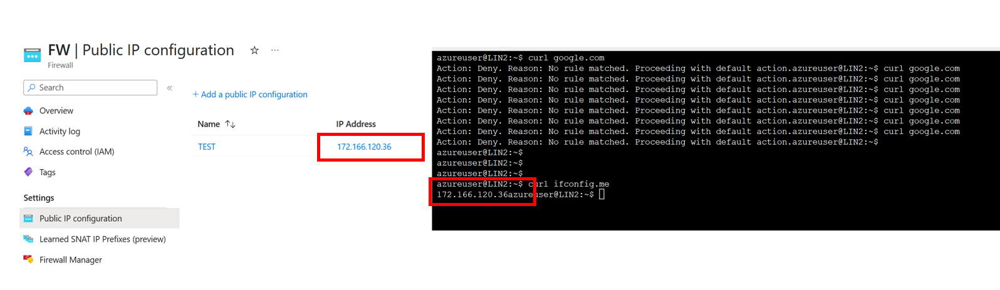

Let's say we have a virtual machine in the same virtual network as the Azure Firewall. So, what we are testing is the below scenario now.

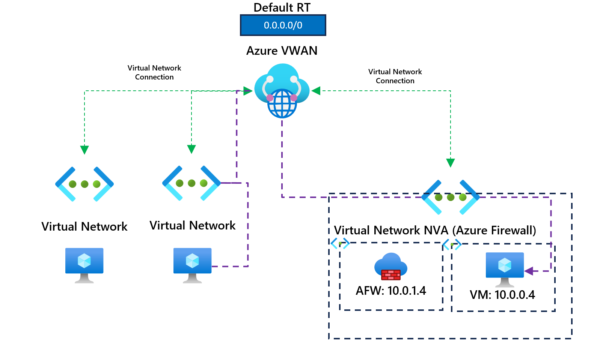

A virtual machine in one of our client virtual networks attempts to access a virtual machine in the same virtual network but a different subnet as our Azure Firewall. We know this should work because we can confirm that connectivity between virtual networks is working as expected. However, let's test our scenario and see.

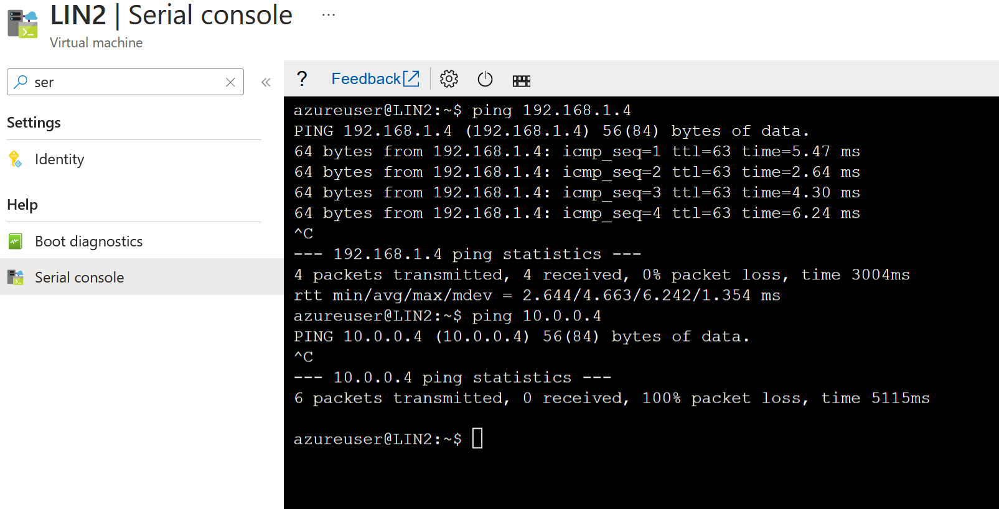

Our first initial ping tests were to the client virtual network 192.168.1.0/24, and we can confirm that pings are working as expected. 

Does this mean we can get to the VM running at 10.0.0.4? It is also connected to the same VWAN. You can see that our pings are failing; they should be working! What's happening here? Looking at the Azure Firewall logs, we can see something interesting.

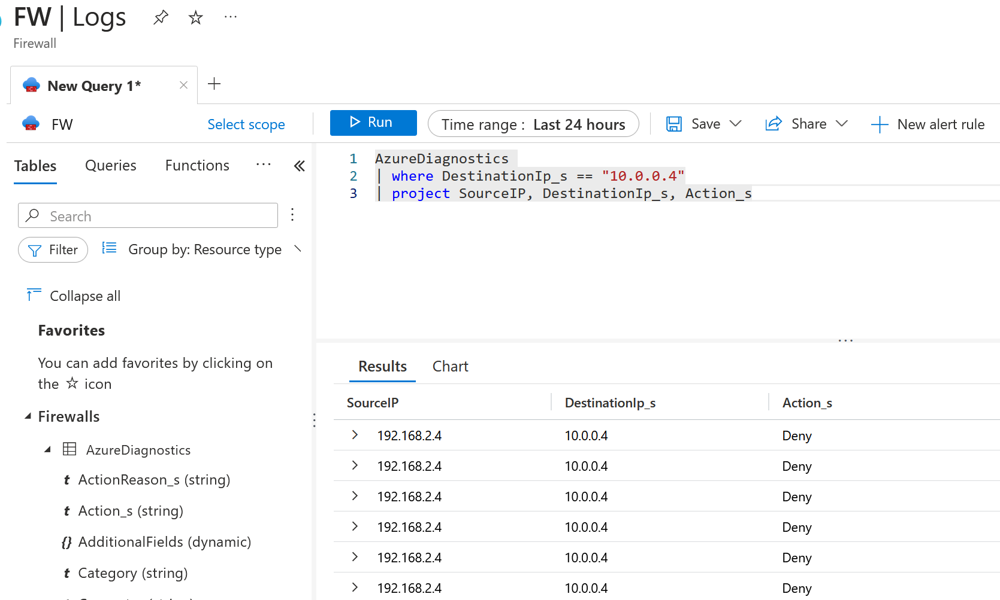

Our VM traffic is being pushed to the Firewall, not directly to the VM. We didn't specify that, did we? Nope! This is a known issue (Not an issue; it's just the expected behaviour). So this is actually what is happening right now.

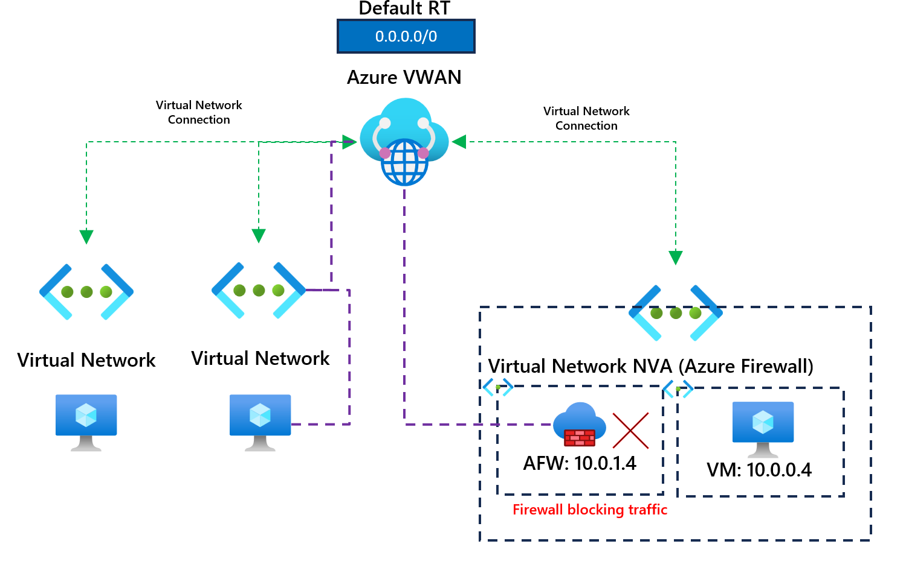

We could add a firewall rule to Azure Firewall and allow pings to 10.0.0.4. This, in theory, would work, but it means that traffic would always be routed through the Azure Firewall, which may or may not be required. 

We can confirm that this is now working by adding a rule to the firewall to allow pings to 10.0.0.4. 

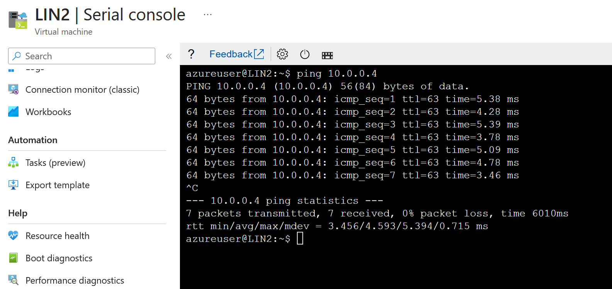

If you need the traffic routed to the NVA (Azure Firewall in our example), great! You don't need to do anything else. You see, traffic is allowed by checking the firewall logs.

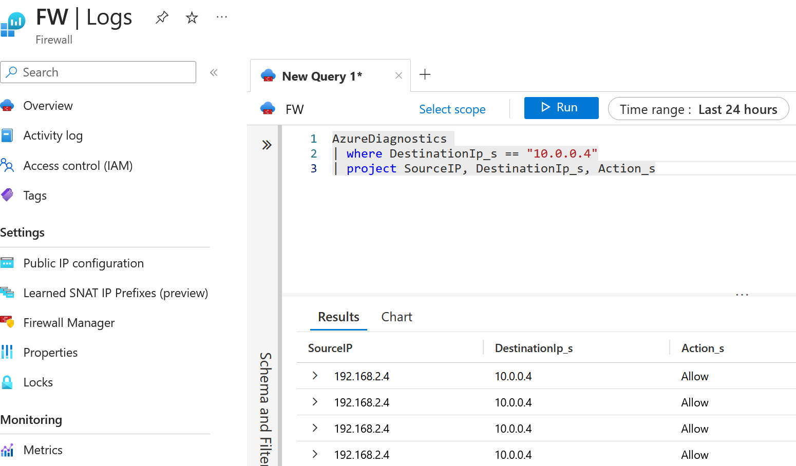

However, what if you have a requirement that traffic shouldn't be routed through the firewall? Before the Bypass Next Hop IP for workloads within this VNet, you could add another static route in the VWAN route table, which stated that if you wanted to connect to the VM (10.0.0.4) in our example, you would need to next hop to 10.0.0.4/32 (Yes, you did read that right, it would route the traffic directly to the VM). The route would look like this in Azure VWAN.

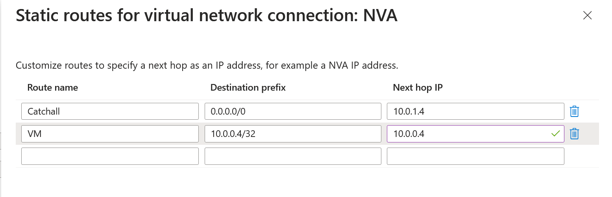

While this does work, what if you had hundreds of virtual machines sitting within the same virtual network? You must add a static /32 entry for each virtual machine. That can cause a massive headache pretty quickly! So, instead, you can enable this directly by using the feature Bypass Next Hop IP for workloads within this VNet. However, you can only set that up on the new virtual connections in VWAN (Not great.). 

You would need to delete the connection if this hasn't been set up and reconfigure the connection; that also means you need to delete any static routes before doing so. How painful.

If I go to my virtual network connection, you can see that it hasn't been enabled on my virtual network connection.

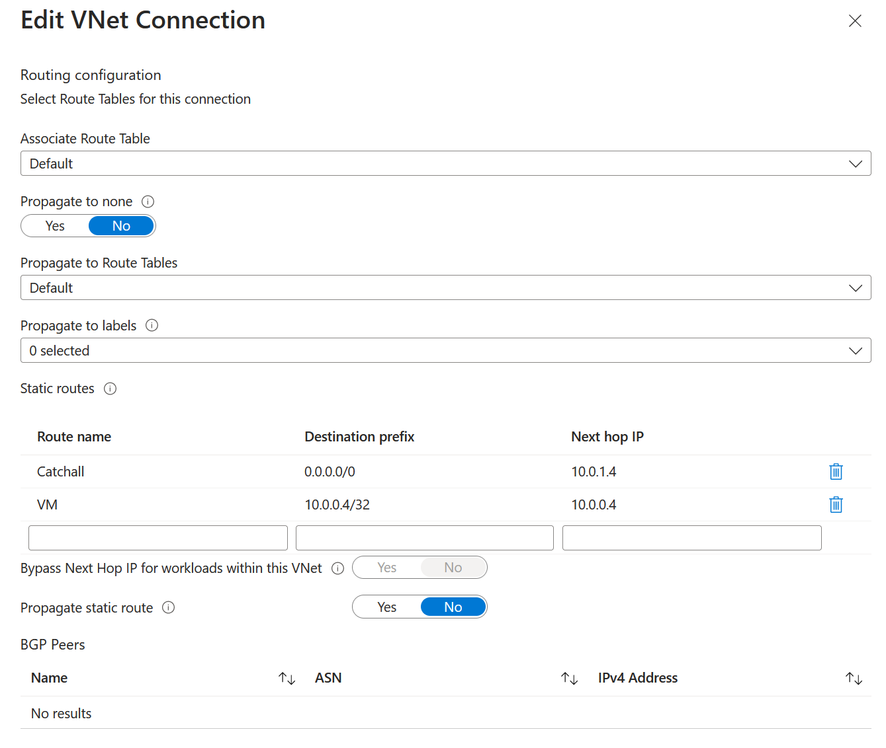

Let's set up the virtual network connection again, but now, with the bypass next hop enabled, we will remove the /32 static route entry for the virtual machine, and we should bypass the firewall; we will then test connectivity and confirm that it's not using the Azure Firewall.

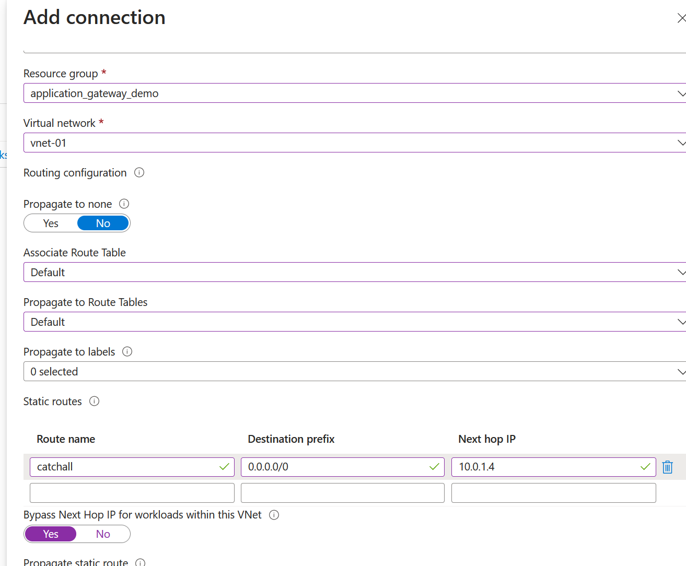

We've now enabled the feature. Let's confirm that our VM connectivity is working. I've also removed the firewall rule that initially allowed connectivity when we wanted to use the firewall.

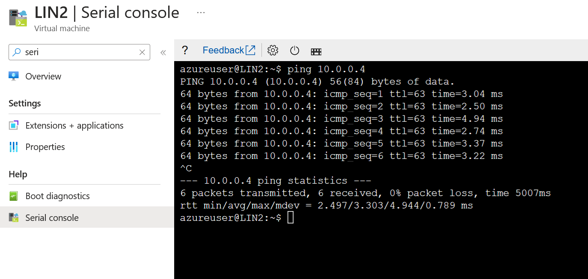

Pinging continues to work, and it's no longer going over the firewall. So now the traffic path looks like the following:

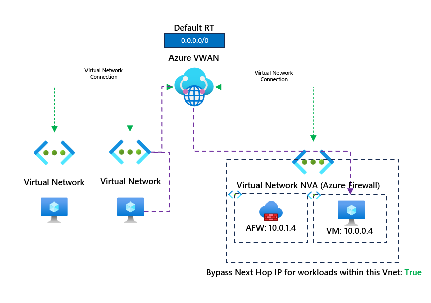

We bypass the firewall entirely, allowing us to connect to other workloads within the same virtual network as the firewall without needing to next hop to the firewall. Thanks for reading this short blog; I hope it becomes helpful to someone.

If you have any questions about this post, please don't hesitate to ask. You can connect with me on social by clicking the link below.
https://bio.link/georgeollis