### Using VM applications and Azure Policy to deploy applications.

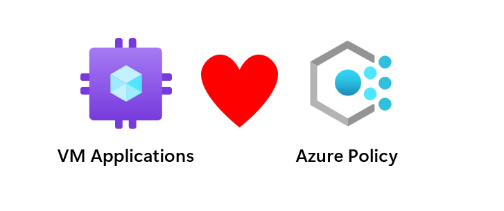

Have you ever had an agent that needed to be installed on all virtual machines, and you wanted a way to do this automatically and the ability to view compliant and non-compliant resources? This is where you can use VM Applications and Azure Policy to achieve just that.

An excellent example of this may be a security agent that needs to be installed post-deployment of a virtual machine, or maybe you have an application that isn't supported in an image-building process and requires that you install said application after a VM has been deployed.

Our example will use 7-Zip, but this could be any application that can be packaged up into an executable or an MSI. (Our example is for Windows, but you can also quickly achieve this in Linux.)

Firstly, you will need an Azure Compute Gallery and a storage account. The storage account is used to upload the applications to the Azure Compute Gallery. However, I'm hoping in the future, Azure will allow you to upload the applications directly into the Azure Compute Gallery, but for now, this is not possible. At this point, these are the two resources you should have within your environment.

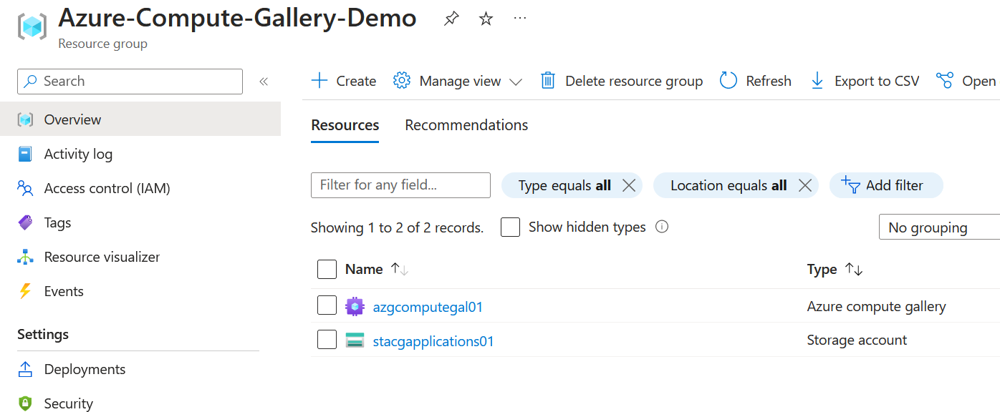

First, let's create a container in our storage account and upload our MSI for 7-Zip. I've provided a screenshot of this below.

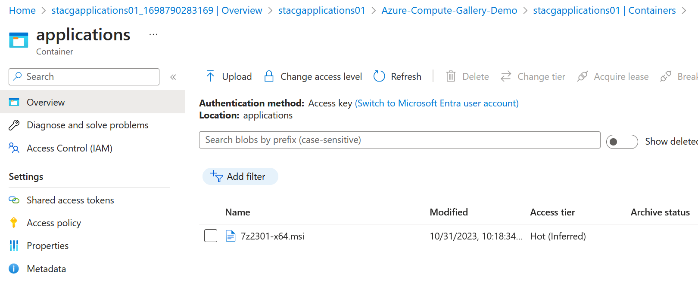

Once we've uploaded the MSI file, we can create the application within the Azure Compute Gallery. First, we need to create a VM Application definition.

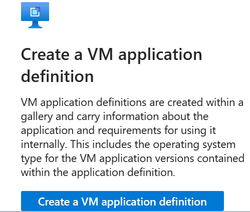

Please provide the application's name, which in our case is 7-Zip and go to the next page.

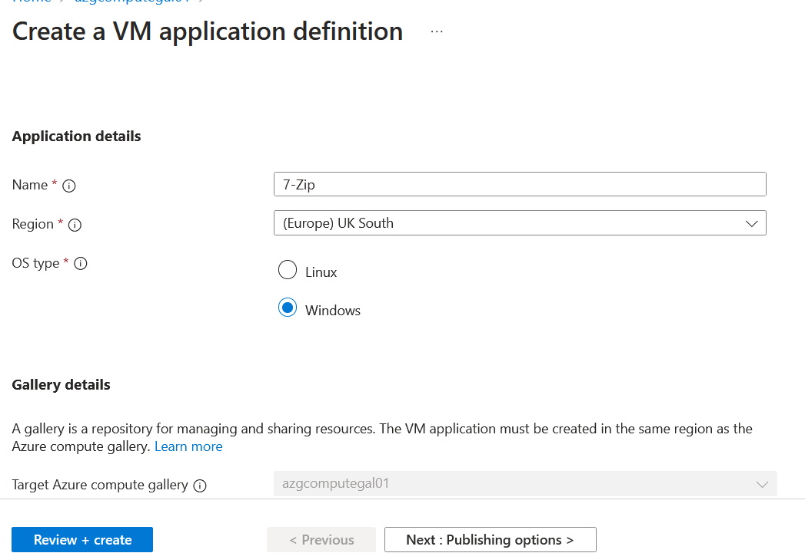

Provide details about what the application is and click review and create.

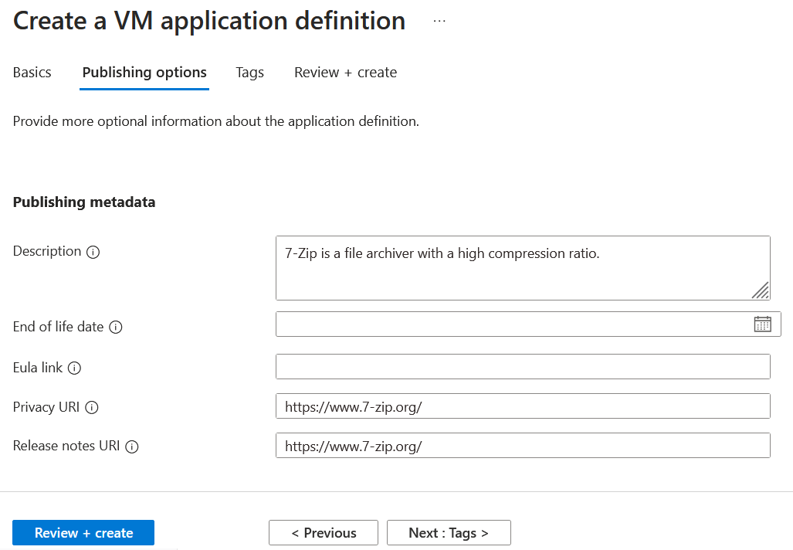

Once that's done, we now have a VM Application definition that has been created.

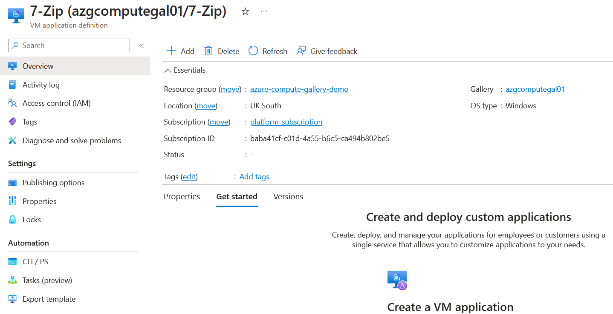

Select add on the VM Application definition, and this will start the process of adding the application package to the Azure Compute Gallery and any additional settings required, such as installation script and uninstall script, etc. It's important to note that when the application file gets downloaded to the VM, it's renamed to the VM Application definition name, which in our example would be 7-Zip. This is because the VM isn't aware of your package's original name or extension. It utilizes the only name it has, which is the application name itself.


Our installation script will change the application's name to the correct MSI name using the following script. The first script is an example, whereas the second one is the one we are using.

````powershell
move .\\VM_APPLICATION_DEFINITION_NAME .\\APPLICATION_NAME_IN_STORAGE_ACCOUNT.msi & start /wait %windir%\\system32\\msiexec.exe /i APPLICATION_NAME_IN_STORAGE_ACCOUNT.msi /qn

move .\\7-Zip .\\7z2301-x64.msi & start /wait %windir%\\system32\\msiexec.exe /i 7z2301-x64.msi /qn
````

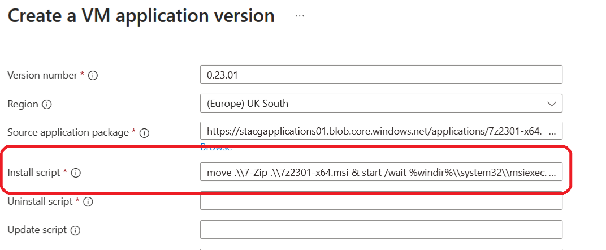

The uninstall script is also required. The easiest way to get this script is to install the application on a test virtual machine and run the following PowerShell cmdlet to get the uninstallString.

```console
Get-ItemProperty hklm:\SOFTWARE\Microsoft\Windows\CurrentVersion\Uninstall\* | select displayName,UninstallString
```

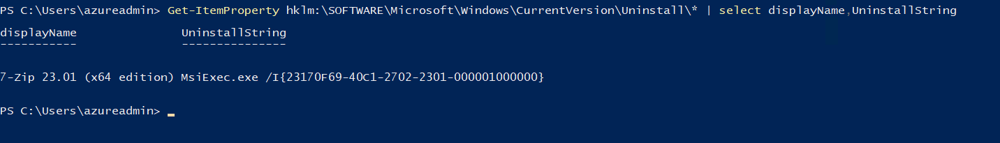

The unique ID is unique for the application and can be reused. The uninstall string should be the following.

```console
MsiExec.exe /x {23170F69-40C1-2702-2301-000001000000} /qn
```

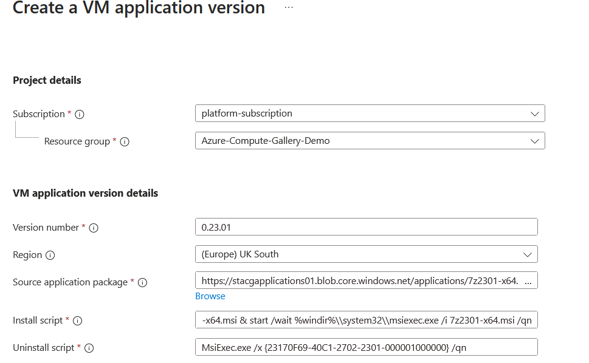

Once that's complete, we can select review and complete, and our VM application version will start deploying. Once it has been deployed successfully, we can see this within the portal.

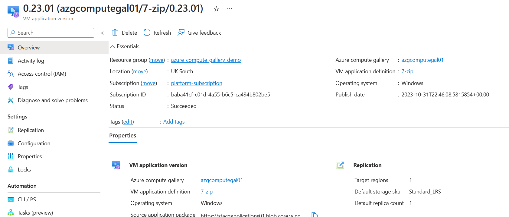

Now that we've got our VM application deployed, we can first test that it works through the Azure Portal. Go to the virtual machine and select extensions and applications.


Find our 7-Zip installation and run through the installation. Once complete, it should look like the following:

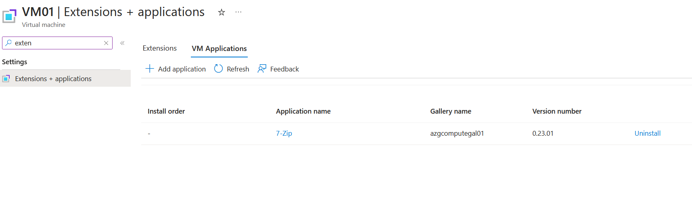

Logging into the virtual machine, I see that 7-Zip has been installed.

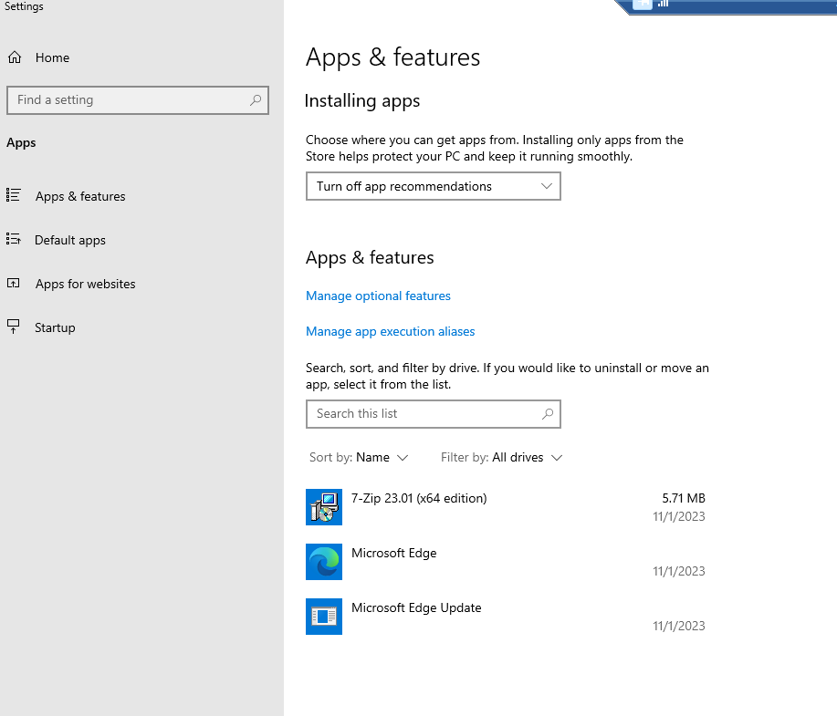

Now, if I want to uninstall the application, go back to the VM Application and click uninstall.

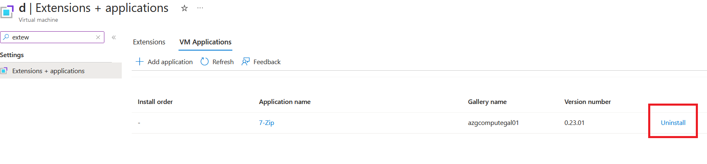

Returning to the virtual machine and running the below command, I can no longer see the 7-Zip.

```console
Get-ItemProperty hklm:\SOFTWARE\Microsoft\Windows\CurrentVersion\Uninstall\* | select displayName,UninstallString
```

So, our concept works, and we can install and uninstall the application. However, we don't want to do this manually, especially if we have hundreds of virtual machines running within the environment. This is where we can use Azure Policy to check if the application is installed, and if not, go ahead and deploy it automatically for us.

The custom policy can be found here: https://raw.githubusercontent.com/georgeollis/VM-Applications-Shared-Image-Gallery/main/Deploy-Applications-Policy-Definition.json

```json
{
  "$schema": "https://schema.management.azure.com/schemas/2019-08-01/managementGroupDeploymentTemplate.json#",
  "contentVersion": "1.0.0.0",
  "metadata": {
    "_generator": {
      "name": "bicep",
      "version": "0.22.6.54827",
      "templateHash": "9602921085150405773"
    }
  },
  "resources": [
    {
      "type": "Microsoft.Authorization/policyDefinitions",
      "apiVersion": "2021-06-01",
      "name": "policyDef",
      "properties": {
        "displayName": "Automatically deploy an application on virtual machines",
        "description": "This policy will automatically deploy an application in the shared compute gallery.",
        "mode": "All",
        "parameters": {
          "applicationVersion": {
            "type": "String"
          },
          "applicationName": {
            "type": "String"
          }
        },
        "policyRule": {
          "if": {
            "allOf": [
              {
                "field": "type",
                "equals": "Microsoft.Compute/virtualMachines"
              },
              {
                "field": "Microsoft.Compute/virtualMachines/storageProfile.osDisk.osType",
                "equals": "Windows"
              }
            ]
          },
          "then": {
            "effect": "deployIfNotExists",
            "details": {
              "type": "Microsoft.Compute/virtualMachines",
              "name": "[[field('name')]",
              "existenceCondition": {
                "allOf": [
                  {
                    "count": {
                      "field": "Microsoft.Compute/virtualMachines/applicationProfile.galleryApplications[*]",
                      "where": {
                        "field": "Microsoft.Compute/virtualMachines/applicationProfile.galleryApplications[*].packageReferenceId",
                        "equals": "[[parameters('applicationVersion')]"
                      }
                    },
                    "greater": 0
                  }
                ]
              },
              "roleDefinitionIds": [
                "/providers/Microsoft.Authorization/roleDefinitions/8e3af657-a8ff-443c-a75c-2fe8c4bcb635"
              ],
              "deployment": {
                "properties": {
                  "mode": "incremental",
                  "template": {
                    "$schema": "https://schema.management.azure.com/schemas/2015-01-01/deploymentTemplate.json",
                    "contentVersion": "1.0.0.0",
                    "parameters": {
                      "vmName": {
                        "type": "string"
                      },
                      "location": {
                        "type": "string"
                      },
                      "packageReferenceId": {
                        "type": "string"
                      },
                      "applicationName": {
                        "type": "string"
                      }
                    },
                    "resources": [
                      {
                        "apiVersion": "2021-07-01",
                        "type": "Microsoft.Compute/virtualMachines/VMapplications",
                        "name": "[[concat(parameters('vmName'), '/', parameters('applicationName'))]",
                        "location": "[[parameters('location')]",
                        "properties": {
                          "packageReferenceId": "[[parameters('packageReferenceId')]"
                        }
                      }
                    ]
                  },
                  "parameters": {
                    "vmName": {
                      "value": "[[field('name')]"
                    },
                    "location": {
                      "value": "[[field('location')]"
                    },
                    "packageReferenceId": {
                      "value": "[[parameters('applicationVersion')]"
                    },
                    "applicationName": {
                      "value": "[[parameters('applicationName')]"
                    }
                  }
                }
              }
            }
          }
        }
      }
    }
  ]
}
```

The policy definition takes in two parameters.

- applicationVersion
- applicationName

The applicationVersion is the resource ID of the VM Application version in the compute gallery.

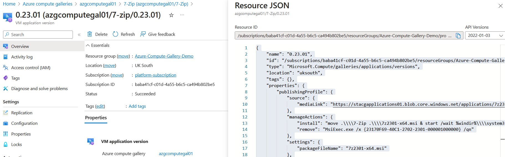

The applicationName parameter is a friendly name for the application. In theory, this parameter value could be anything. In our example, we have used 7-Zip as the name.

When assigning the custom policy definition, these are the values for the parameters.

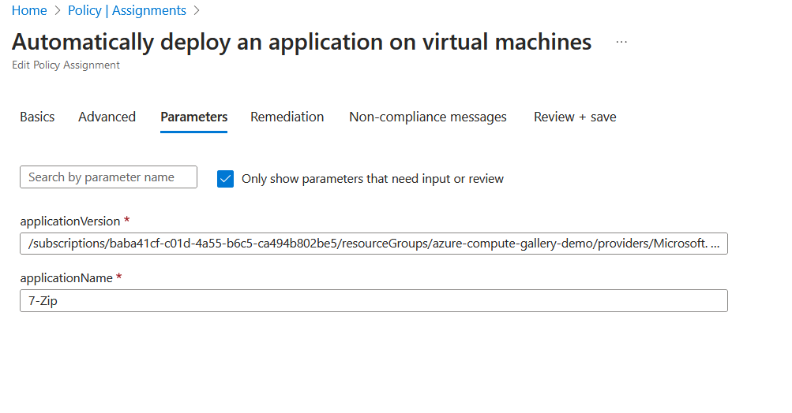

If I check compliance, I can see that my virtual machine is compliant and has the application installed.

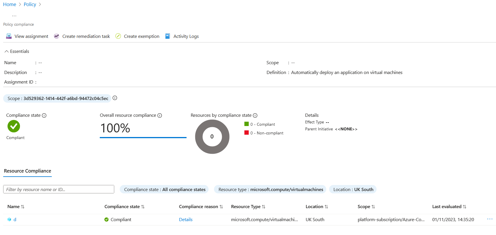

If I deploy another virtual machine now, the deployIfNotExists policy should install the application. I can see that the virtual machine is marked as non-compliant.


If I create a remediation task, it will install the application. It's also important to note that new virtual machines will be automatically remediated, whereas existing resources will need to have a remediation task run against them.

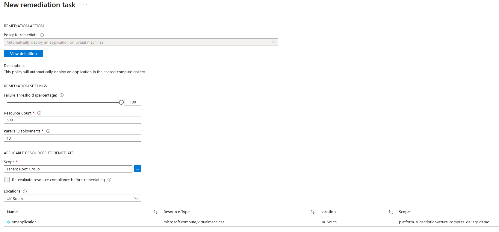

On the virtual machine within Azure, you can see that the VM application has been installed via activity logs.

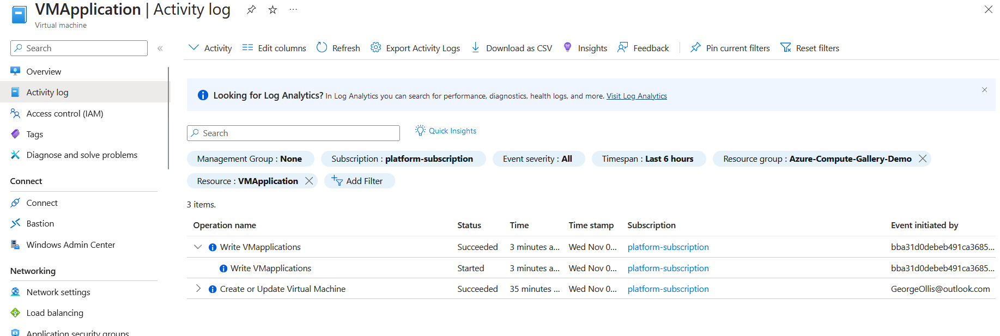

Logging into the virtual machine, I see that 7-Zip is now installed.

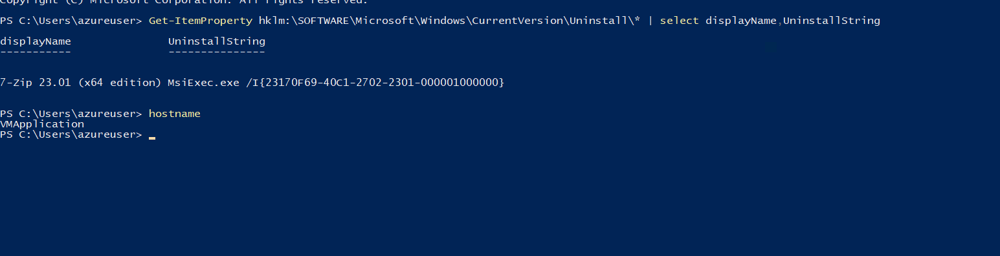

If you have any questions about this post, please don't hesitate to ask. You can connect with me on social by clicking the link below.

https://bio.link/georgeollis
