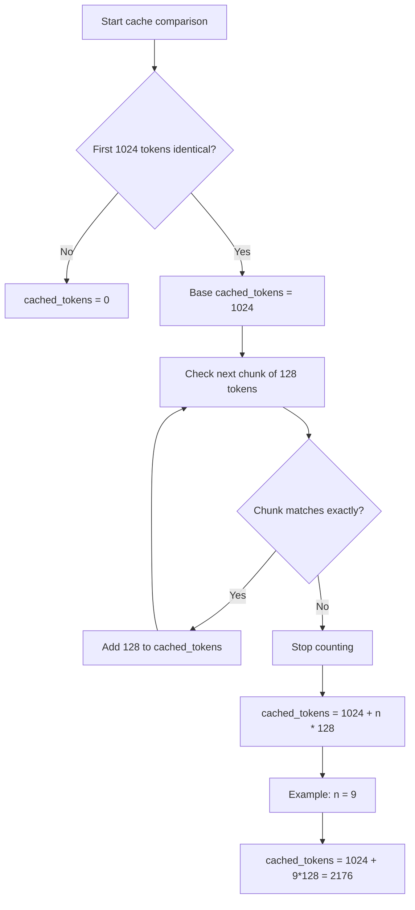

Hello everyone,

In this post, I'll walk you through **prompt caching** in **Microsoft Foundry**: a powerful feature that can make your applications faster and cheaper when working with longer text. If you're building agents in **Foundry**, understanding how caching works can help you save both time and money.

**Prompt caching** is simple: instead of processing the same text over and over, the system remembers the work it's already done and reuses that result. This means faster responses and lower bills.

## What is Prompt Caching?

Prompt caching is like remembering the first part of a long task. When you send a prompt to the AI, the system processes it and remembers the work from the beginning. If your next request starts with the exact same text, it can skip redoing that work and jump straight to processing what's new.

This is particularly useful when you have:

- Large system prompts or instructions that don't change
- Repetitive documents or context being analyzed
- Multi-turn conversations with shared context
- Structured data or knowledge bases that are consistently referenced

The key benefit: **cached tokens cost much less to use** than new ones. In fact, with **Provisioned deployments**, cached tokens might not cost anything at all.

## Requirements for Prompt Caching

For caching to work, you need two things:

1. **Long enough prompt**: At least 1,024 tokens (roughly 3,000-4,000 words)
2. **Identical beginning**: The first 1,024 tokens must be exactly the same in each request

The system checks the beginning of your prompt to see if it's seen this exact text before.

**Remember**: inputs with fewer than 1,024 tokens never get cache hits.

## Cache Hits and Performance

When the system finds your text in the cache and reuses it, that's a **cache hit**. You'll see this in the response as `cached_tokens` under `prompt_tokens_details`:

```json
{
  "usage": {
    "completion_tokens": 1518,
    "prompt_tokens": 1566,
    "total_tokens": 3084,
    "prompt_tokens_details": {
      "cached_tokens": 1408
    }
  }
}
```

In this example, 1,408 tokens came from the cache, so they were charged at the cache rate (much cheaper). 

**Important**: After the first 1,024 tokens, the system checks every 128 new identical tokens. Even one character different in the first 1,024 tokens means no cache hit (cached_tokens = 0).

## Prompt Cache Retention Policies

Microsoft Foundry supports two retention policies for prompt caching:

### In-Memory Cache Retention

- **Duration**: Typically cleared within 5-10 minutes of inactivity, always removed within one hour
- **Availability**: All Azure OpenAI models GPT-4o or newer
- **Use case**: Best for high-frequency requests in active sessions

### Extended Cache Retention

- **Duration**: Up to 24 hours
- **Availability**: Supported on newer models (check the documentation for your specific model)
- **How it works**: Saves the cached data to storage when the server gets full, so it can be used later
- **Use case**: Best for requests that happen occasionally but need to reuse the same content over a full day

## Configuring Retention Policy

You can specify the retention policy per request using the `prompt_cache_retention` parameter:

```json
{
  "model": "gpt-5.4",
  "input": "Your prompt goes here...",
  "prompt_cache_retention": "24h"
}
```

Allowed values are `in_memory` and `24h`, though availability depends on your model.

## What Gets Cached?

Prompt caching works with:

- **Messages**: Complete messages array (system, developer, user, and assistant content)
- **Images**: Both links and base64-encoded data (must have same detail parameter across requests)
- **Tools**: Both message array and tool definitions
- **Structured Outputs**: Schema is appended as a prefix to the system message

## Best Practices for Effective Caching

To get the most from caching:

1. **Put the same content first**: Always put instructions and context that don't change at the very start
2. **Use stable prompts**: System messages and instructions are perfect for caching
3. **Be exact**: Even tiny changes will break the cache, so keep the beginning identical
4. **Watch your cache hits**: Check `cached_tokens` in responses to see if caching is actually helping

## Example: Good Use Cases

### Agent workflows with fixed tool schemas

Tool definitions and structured output schemas can be large and repeated on every call.

### Batch processing of similar tasks

Example: classify and summarise thousands of records with the same instructions and output format.

## Important Notes

- **Caching is on by default**: You don't have to do anything to enable it
- **Regional deployment**: In-memory caching works everywhere; extended caching needs specific deployment types
- **Your data stays private**: Caches aren't shared between different Azure subscriptions
- **Request limits**: If you send more than about 15 requests per minute with the same beginning, some may go to different servers and miss the cache

## Let's have a look:

For the purpose of demonstrating this, I built a Streamlit application that shows this in practice. We will create an agent with a prompt that is larger than 1,024 tokens. The instructions relate to it being an expert in the automotive industry.


Initially, I send it a message saying "Hi", and the details are below:


Input tokens: 2,193. However, it's a fresh session, and we've never used this before. If I send the same message again, stating "Hi":


This time we can see that 2,176 tokens were taken directly from the cache. Why this number?

## Why `cached_tokens` was 2,176 (the exact math)

At first glance, this looks odd because my visible system prompt is around 2,182 tokens. The key point is that **`cached_tokens` is based on the full internal prompt**, not just the visible system prompt.

In Foundry, the model input typically includes:

- system instructions
- developer instructions
- tool definitions and schemas
- prior user and assistant messages
- service-level scaffolding injected by the platform

So the cache comparison runs against that full token stream.

### Cache matching rules

1. The first 1,024 tokens must match exactly
2. After that, matching is counted in 128-token blocks
3. `cached_tokens` equals the total matched tokens

### Reconstructing 2,176

If `cached_tokens = 2176`, the match was:

$$
1024 + (9 \times 128) = 1024 + 1152 = 2176
$$

Here is the same logic as a flow diagram:



That means:

- the initial 1,024-token prefix matched
- 9 additional 128-token blocks also matched
- the next 128-token block did not fully match, so counting stopped at 2,176

This is normal and expected behavior.
